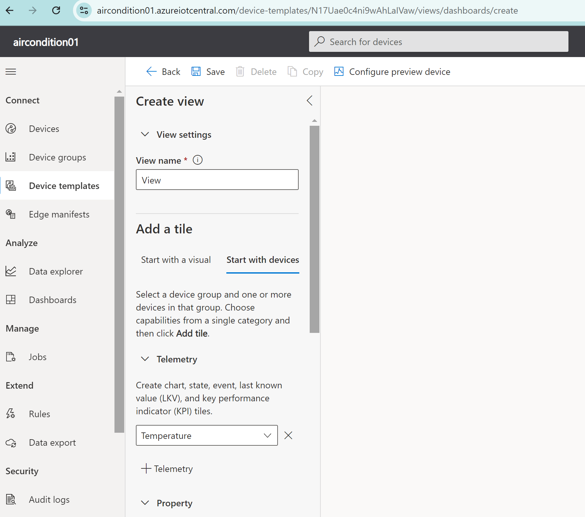
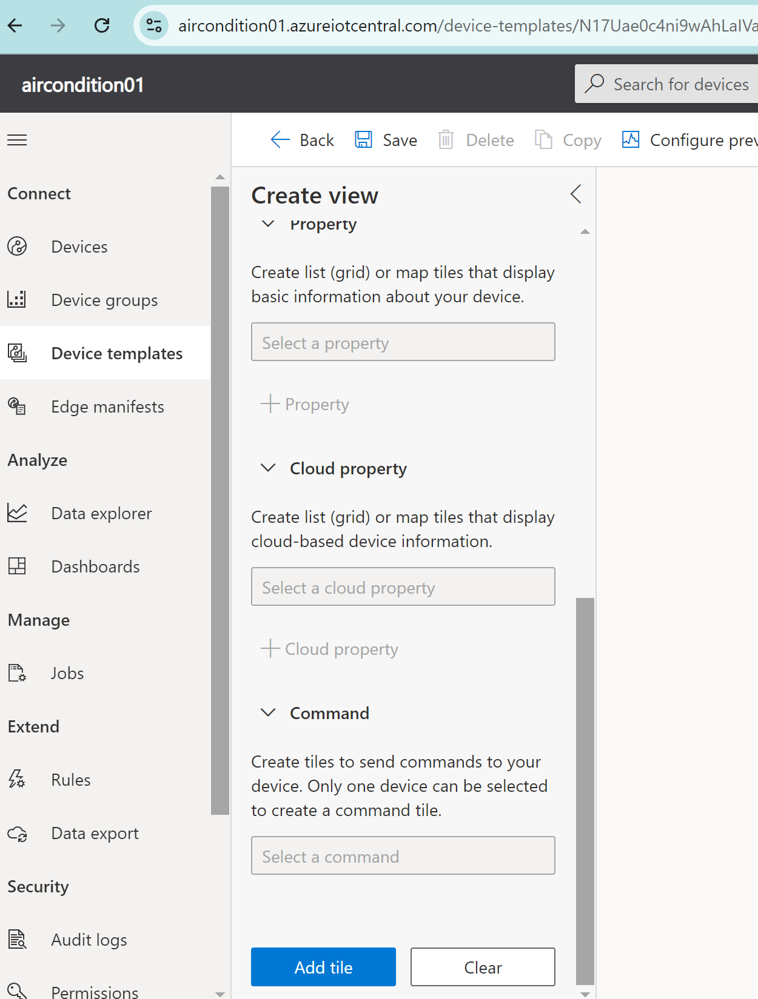
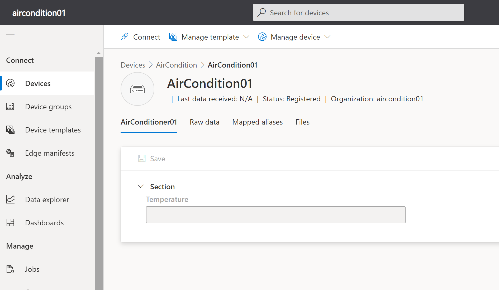

# AirConditionIoTCentral

This project allows you to control air conditioning using Azure IoT Central. Commands to the air conditioning unit will be sent via infrared (first, we record them from the original remote controller).

## Prerequisites

Install and customize (connect to the network) your Raspberry Pi. Any of the following models are supported: Zero, Zero W, 1A+, 1B+, 2B, 3B, 3B+, 3A+, 4B, 400, CM1, CM3, CM3+, CM4, CM4S, Zero 2 W. The best way is to use the Raspberry Pi Imager: [Raspberry Pi Imager](https://www.raspberrypi.com/software/).

## No Wireless Interface Found

In case you use a USB Realtek or similar WiFi adapter, use the Raspberry Pi OS with desktop image (Debian version: 12 (bookworm)).

## Hardware

We will be using the following additional equipment. The equipment is well known and can be substituted with similar items.

### Temperature and Humidity Sensor DHT11 - Module + Wires

We will be using it simply to get the temperature, so based on it we will know if the air conditioner is working or not.
- [Botland Store](https://botland.store/multifunctional-sensors/1886-temperature-and-humidity-sensor-dht11-module--5903351242448.html)
- [Anodas](https://www.anodas.lt/en/dht11-module-arduino-temperature-and-humidity-sensor)

### IR Receiver + Wire - Iduino SE027

We will be using it to record the sequences (buttons) from the original remote controller.
- [Botland Store](https://botland.store/ir-receivers/14283-ir-receiver-wire-iduino-se027-5903351242165.html)
- [Anodas](https://www.anodas.lt/en/ir-receiver-cable-iduino-se027)

### IR 940nm Transmitter + Wire - Iduino SE028

The main component via which we will send infrared commands to the air conditioner.
- [Botland Store](https://botland.store/led-ir-infrared/14286-ir-940nm-transmitter-wire-iduino-se028-5903351242011.html)
- [Anodas](https://www.anodas.lt/en/ir-940nm-transmitter-wire-iduino-se028?search=Iduino%20SE028)

## Assembly

If all hardware is acquired let's connect it together.

### Assumption

GPIO will be used as a input/output devices. Each GPIO is set as in or out, the assumption is that the system is clear and all GPIO are disabled and all are set as in. So simply clear configuration. Please check the following:
```
ls -R /sys/class/gpio
```
It should be empty.

Please review the Rapberry PI pinouts - the best here: https://pinout.xyz/

### Connections

#### Temperature and Humidity Sensor DHT11

GND (-) - connect to Pin 6 - Ground
VCC (+) - connect to Pin 1 - 3v3 V
OUT - connect to Pin 11 - GPIO 17

### IR Receiver - Iduino SE027

GND (-) - connect to Pin 14 - Ground
VCC (+) - connect to Pin 2 - 5 V
DAT - connect to Pin 13 - GPIO 27


### IR 940nm Transmitter - Iduino SE028

GND (-) - connect to Pin 9 - Ground
VCC (+) - connect to Pin 4 - 5 V
DAT - connect to Pin 15 - GPIO 22

## Configure GPIO

GPIO are not configured in your Rasperry out of the box, so we need to configure them enable it. After enabling GPIO are configured as input device, so for output device we need to perform additional step.

Log in to your Raspberry Pi and perform the following.

```
echo 17 > /sys/class/gpio/export
echo 27 > /sys/class/gpio/export
echo 22 > /sys/class/gpio/export
echo out > /sys/class/gpio/gpio22/direction
ls -R /sys/class/gpio/
```

## Azure IoT Central

See the Appendix 01 - IoT Central Sample Project to get knowedgle about the

### Basic config

1. Create new IoT Central Applcation https://portal.azure.com/#create/Microsoft.IoTCentral
2. Choose Custom Application, and procing Plan 0.
   
3. Go to your creatded application [name].azureiotcentral.com - e.g. [azureiotcentral.com](https://aircondition01.azureiotcentral.com/)
4. Go to the Device Templates, and create new Template choosing IoT device
   
5. Chose a name e.g AirCondition, and chose Create
   
6. Add Telemetry - Temperature
   
   
7. Save and goto Views and chose Vizualizing the Device
   
8. Start the Device add Temperature
   
9. Add Tile and Configure Tile finally Update and Save
   
   
10. Publish
    
11. GoTo devices
12. 12. Click Create
    
13. Click on Device and than Connect
    
    
16. Note the ID scope, Device ID, Primary key

## Appendix 01 - IoT Central Sample Project

## Test the application

```
clone the repository:
git clone https://github.com/MariuszFerdyn/AirConditionIoTCentral/
cd AirConditionIoTCentral
vi SendTemperature.sh
```
add the ID scope, Device ID, Primary key
```
chmod 755 
./SendTemperature.sh
```

In IoT Central you should see the temperature.

  

## Azure IoT Central - Extend Application to Sends Commannds

Now we need to add button that will send the InfraRed commands to Raspberry PI and Raspberry PI will activare Infra Red sender to send them to the Air Condition.

### Add config to IoT Central to Sends Commands

1. Click Templates and Edit Template
2. Add Capability as command
   
3. Configure On and Off including strings recorded from Remote COntroler (in scren OffOffOff / OnOnOn)
   
4. Save
5. Go to View
6. Scroll Down to Property and add Command On and Click Add Tile
   
7. Do the same for Off
   
8. Save and Publish Template

## Appendix 01 - IoT Central Sample Project

[IoT Central Sample Project](https://github.com/gloveboxes/Create-RaspberryPi-dotNET-Core-C-Sharp-IoT-Applications/tree/master/labs/Lab_2_Azure_IoT_Central)
